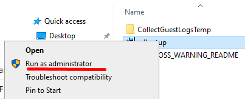
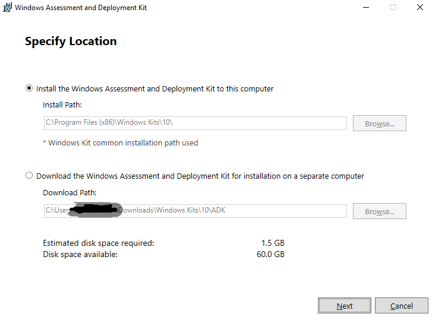
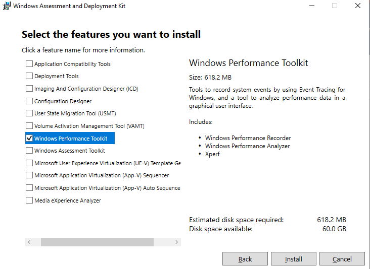
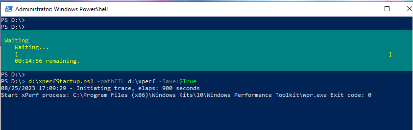
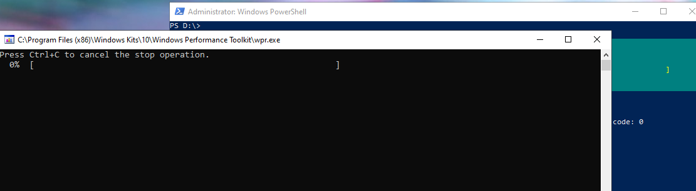
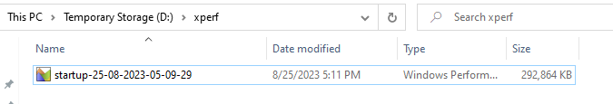

# Capture traces and event during notepad slowness issue

if you are able to reproduce the issue, then follow the below steps to capture traces and events.

- Open the command prompt as an administrator and run the below command to download the ADKsetup tool.
```powershell
Invoke-WebRequest -Uri https://go.microsoft.com/fwlink/?linkid=2165884 -outFile d:\adksetup.exe
```
- Open explorer and navigate to d: drive.

- right click on adksetup.exe and select run as administrator, **provide administrator** credentials if prompted.


- Spécify Location, make sure **install the windows assess...** is selected and click on next



- Select the privacy yes or no and click next
- Read and accept the license terms and click next
- uncheck all except windows performance toolkit and click install

- wait for the installation to complete and click close
- run the following command to download the xperfStartup.ps1 file
```powershell
Invoke-WebRequest -Uri https://raw.githubusercontent.com/sepenet/workdev-alst-PLM/main/MonitoringTroubleshoot/xperfStartup.ps1 -outFile d:\xperfStartup.ps1
```
- run the 2 following command to create folder to store the output file and to start the trace
```powershell
mkdir d:\xperf
d:\xperfStartup.ps1 -pathETL d:\xperf -Save:$True
```
traces collection will start and last **15min** and will be saved in d:\xperf folder


- reproduce the issue while the trace is running
> you can stop the trace by pressing **ctrl+c** in the command prompt
> you might have to do ctrl+c twice to stop the trace
command prompt windows open automatically after the trace is stopped to save it in the file, let it runs and close automatically

- Navigate to d:\xperf folder and you will find the file with the name **startup-<date and time>**


>[!IMPORTANT]
> do not stop the VM without saving the file, if you do so, you will **loose the file** as store on temporay store D: 
