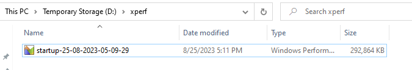

# PLM test process to start PLM and record start and stop times

## without disk speed test

### Install ADKsetup tool

- [ ] Open powershell as Administrator and run the below command to download the ADKsetup tool.
    ```powershell
    Invoke-WebRequest -Uri https://go.microsoft.com/fwlink/?linkid=2165884 -outFile d:\adksetup.exe
    d:\adksetup.exe /quiet /installpath d:\ADK /features OptionId.WindowsPerformanceToolkit
    ```
### Install Az powershell module.

- [ ] Install the Az powershell module by running the following command in powershell windows as an administrator 
    ```powershell
    Install-Module -Name Az.accounts,Az.Resources -AllowClobber
    Install-Module -Name Az.Compute
    ```
> Accept the installation of the module and dependencies by typing  **A** or **Y** and press enter
> this will take few minutes to complete
- [ ] Run the followinf commands to import the modules, login to azure using the user assigned managed identity, and get the vmID
    ```powershell
    Set-ExecutionPolicy -ExecutionPolicy Unrestricted -Scope LocalMachine
    Import-module az.accounts
    Import-module az.resources
    Import-module az.compute
    Connect-AzAccount -identity
    ```
>[!IMPORTANT]
> Accept the policy change by typing  **A**

### dowload azcopy

- [ ] run the following commands to download and expand azcopy
    ```powershell
    Invoke-WebRequest -Uri https://aka.ms/downloadazcopy-v10-windows -outfile d:\azcopy.zip
    Expand-Archive -path d:\azcopy.zip -destinationpath d:
    mv d:\azcopy_windows_*\azcopy.exe d:\azcopy.exe
    ```

### dowload the script to start the trace.

- [ ] run the following commands to create  to download the xperfStartup.ps1 file 
    ```powershell
    Invoke-WebRequest -Uri https://raw.githubusercontent.com/sepenet/workdev-alst-PLM/main/MonitoringTroubleshoot/xperfStartup.ps1 -outFile d:\xperfStartup.ps1
    ```
- [ ] run the following commands to create folder to collect VM info and to start the xperf recording
    ```powershell
    mkdir d:\xperf
    $HOSTNAME=$env:computername
    $VMPROPERTIES=get-azvm -name $HOSTNAME
    $RG=$VMPROPERTIES.psobject.properties["resourcegroupname"].value
    $VMPROPERTIES=get-azvm -name $HOSTNAME -displayHint expand -resourcegroupname $RG
    $VMIDVALUE=$VMPROPERTIES.psobject.properties["VmId"].value
    powershell.exe {d:\xperfStartup.ps1 -pathETL d:\xperf -Save:$True}
    $PLMSTARTTIME=get-date -format "HH:mm:ss"
    echo "It is now time to start PLM application, perform the test and stop the trace and come back here to press enter when finished."
    pause
    $PLMSTOPTIME=get-date -format "HH:mm:ss"
    echo "HOSTNAME,RG,VMIDVALUE,PLMSTARTTIME,PLMSTOPTIME" | out-file d:\vmInfo.txt
    echo "$HOSTNAME,$RG,$VMIDVALUE,$PLMSTARTTIME,$PLMSTOPTIME" | out-file -append d:\vmInfo.txt
    ```
>[!IMPORTANT]
> traces collection will start and last **15min** and will be saved in d:\xperf folder
> 

- [ ] execute the following command
> you can stop the trace by pressing **ctrl+c** in the command prompt
> you might have to do ctrl+c twice to stop the trace
command prompt windows open automatically after the trace is stopped to save it in the file, let it runs and close automatically

- Navigate to d:\xperf folder and you will find the file with the name **startup-<date and time>**


>[!IMPORTANT]
> do not stop the VM without saving the file, if you do so, you will **loose the file** as store on temporay store D: 


```powershell
d: 
mkdir speedTest
Invoke-WebRequest -Uri https://github.com/microsoft/diskspd/releases/download/v2.1/DiskSpd.ZIP -outFile d:\speedTest\DiskSpd.ZIP
Expand-Archive -path d:\speedTest\DiskSpd.ZIP -DestinationPath d:\speedTest\DiskSpd
echo "hostname,start time diskspd test,start time PLM app,stop time APP PLM" > d:\plmStart.txt
hostname >> d:\plmStart.txt
get-date -format "HH:mm:ss" >> d:\plmStart.txt
D:\speedTest\DiskSpd\amd64\diskspd.exe -d300 -W15 -C15 -L -r -w40 -t8 -b64K -Su -c10G C:\CATIA_V6_21X_FD14\perfdisk.io > D:\speedTest\plmVDIb64_01
pause
get-date -format "HH:mm:ss" >> d:\plmStart.txt
&'C:\Program Files\PLM4AUpdater\PLM4AUpdater.exe' "C:\Users\201039351\AppData\Local\PLM4ALauncher\INT\PLM4ALauncher_474ADE038B803AF8BDE177E432CB69D8.plm4a"
pause
get-date -format "HH:mm:ss" >> d:\plmStart.txt
D:\speedTest\DiskSpd\amd64\diskspd.exe -d300 -W15 -C15 -L -r -w40 -t8 -b64K -Su -c10G C:\CATIA_V6_21X_FD14\perfdisk.io > D:\speedTest\plmVDIb64_02
notepad d:\plmStart.txt
notepad D:\speedTest\plmVDIb64_02
notepad D:\speedTest\plmVDIb64_01
```

## including diskspd test.

```powershell
d: 
mkdir speedTest
Invoke-WebRequest -Uri https://github.com/microsoft/diskspd/releases/download/v2.1/DiskSpd.ZIP -outFile d:\speedTest\DiskSpd.ZIP
Expand-Archive -path d:\speedTest\DiskSpd.ZIP -DestinationPath d:\speedTest\DiskSpd
echo "hostname,start time diskspd test,start time PLM app,stop time APP PLM" > d:\plmStart.txt
hostname >> d:\plmStart.txt
get-date -format "HH:mm:ss" >> d:\plmStart.txt
D:\speedTest\DiskSpd\amd64\diskspd.exe -d300 -W15 -C15 -L -r -w40 -t8 -b64K -Su -c10G C:\CATIA_V6_21X_FD14\perfdisk.io > D:\speedTest\plmVDIb64_01
pause
get-date -format "HH:mm:ss" >> d:\plmStart.txt
&'C:\Program Files\PLM4AUpdater\PLM4AUpdater.exe' "C:\Users\201039351\AppData\Local\PLM4ALauncher\INT\PLM4ALauncher_474ADE038B803AF8BDE177E432CB69D8.plm4a"
pause
get-date -format "HH:mm:ss" >> d:\plmStart.txt
D:\speedTest\DiskSpd\amd64\diskspd.exe -d300 -W15 -C15 -L -r -w40 -t8 -b64K -Su -c10G C:\CATIA_V6_21X_FD14\perfdisk.io > D:\speedTest\plmVDIb64_02
notepad d:\plmStart.txt
notepad D:\speedTest\plmVDIb64_02
notepad D:\speedTest\plmVDIb64_01
```